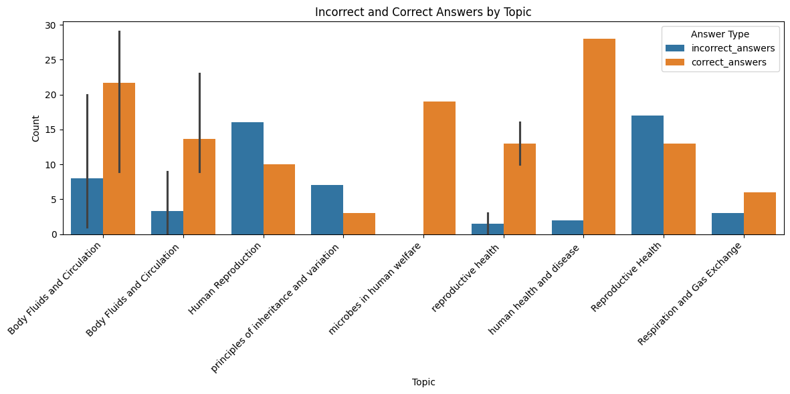
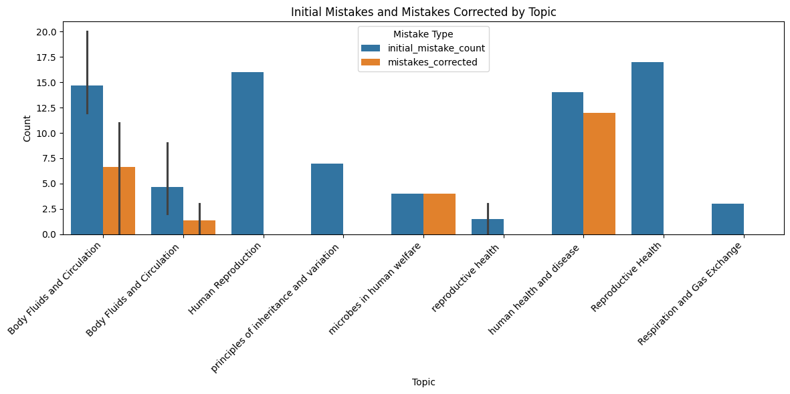
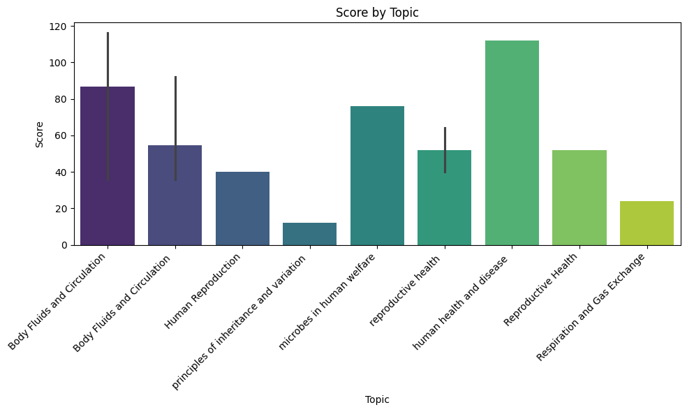
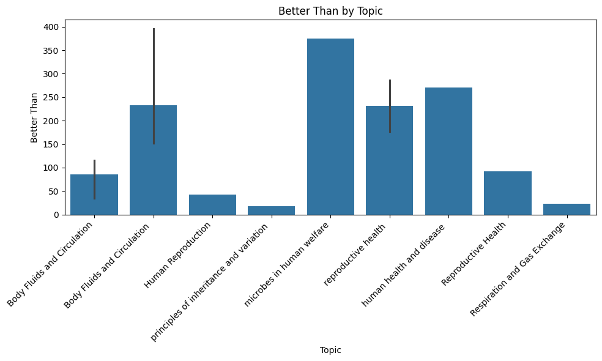
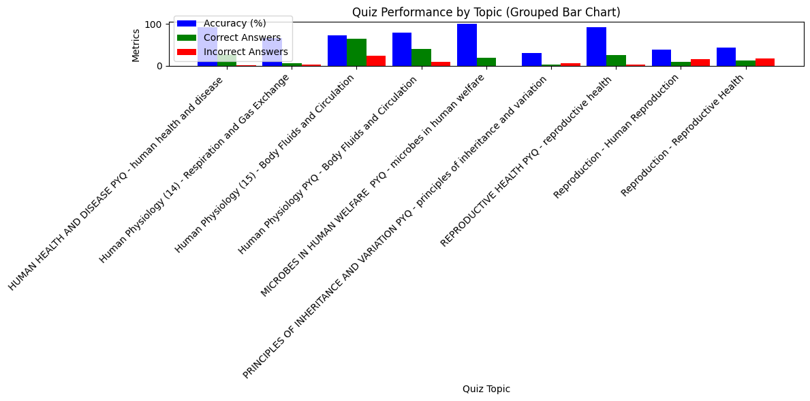
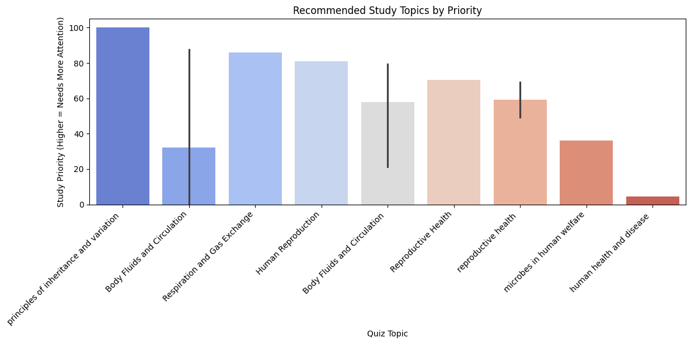

# MarksAnalyzer_TestLine            

## Overview
This Flask application allows users to upload a JSON link, process the data into a DataFrame, and generate insightful visualizations based on quiz-related metrics. The app dynamically renders six plots in the browser, providing an interactive way to analyze quiz performance data.

## Features
- **JSON Data Upload**: Accept a JSON link as input.
- **Data Transformation**: Converts JSON data into a Pandas DataFrame.
- **Six Visualizations**:
  1. Incorrect and Correct Answers by Topic
  2. Initial Mistakes and Mistakes Corrected by Topic
  3. Score by Topic
  4. Better Than by Topic
  5. Average Accurcy by Title-Topic based on Correct ,  Incorrect and Speed 
  6. Recommend topics to study
- **Dynamic Web Display**: Uses Flask to render plots on a web page.
- **Base64 Encoding**: Converts Matplotlib plots into images for seamless integration with HTML.

## Prerequisites
- Python 3.7 or higher
- Required Python libraries:
  - Flask
  - Pandas
  - Matplotlib
  - Seaborn
  
## Installation & Run:
   ```bash
   git clone https://github.com/vinu0404/MarksAnalyzer_TestLine
   cd MarksAnalyzer_TestLine
   pip install -r requirements.txt
   run python app.py

   ```
  
## Visulization:











